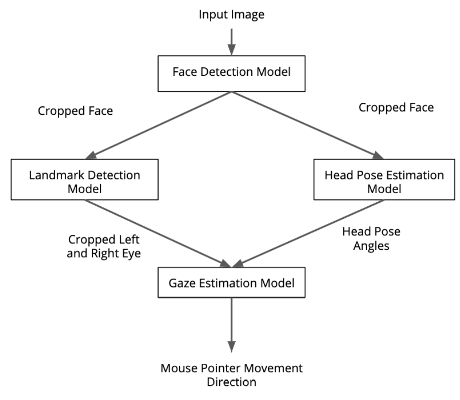

# Overview: Computer Pointer Controller

In this project, you will use a gaze detection model to control the mouse  pointer of your computer. You will be using the [Gaze Estimation](https://docs.openvinotoolkit.org/latest/_models_intel_gaze_estimation_adas_0002_description_gaze_estimation_adas_0002.html) model to estimate the gaze of the user's eyes and change the mouse pointer position accordingly. This project will demonstrate your ability to run multiple  models in the same machine and coordinate the flow of data between those models.

## How it works

You will be using the InferenceEngine API from Intel's OpenVino ToolKit to build the project. The gaze estimation model requires three inputs:

* The head pose
* The left eye image
* The right eye image.

To get these inputs, you will have to use three other OpenVino models:

* [Face Detection](https://docs.openvinotoolkit.org/latest/_models_intel_face_detection_adas_binary_0001_description_face_detection_adas_binary_0001.html)
* [Head Pose Estimation](https://docs.openvinotoolkit.org/latest/_models_intel_head_pose_estimation_adas_0001_description_head_pose_estimation_adas_0001.html)
* [Facial Landmarks Detection](https://docs.openvinotoolkit.org/latest/_models_intel_landmarks_regression_retail_0009_description_landmarks_regression_retail_0009.html)

## The Pipeline

You will have to coordinate the flow of data from the input, and then amongst the different models and finally to the mouse controller. The flow of data will look like this:

While building the flow, you will need to make sure that you are aware of the input and output shapes of each model. If the shapes or data format are different for a particular model, you can account for this in the preprocessing methods.

## Useful Links
You may find these links useful to you when building your project:
* [Inference Engine API Docs](https://docs.openvinotoolkit.org/latest/_inference_engine_ie_bridges_python_docs_api_overview.html)
* [Model Documentation](https://docs.openvinotoolkit.org/latest/_models_intel_index.html)

