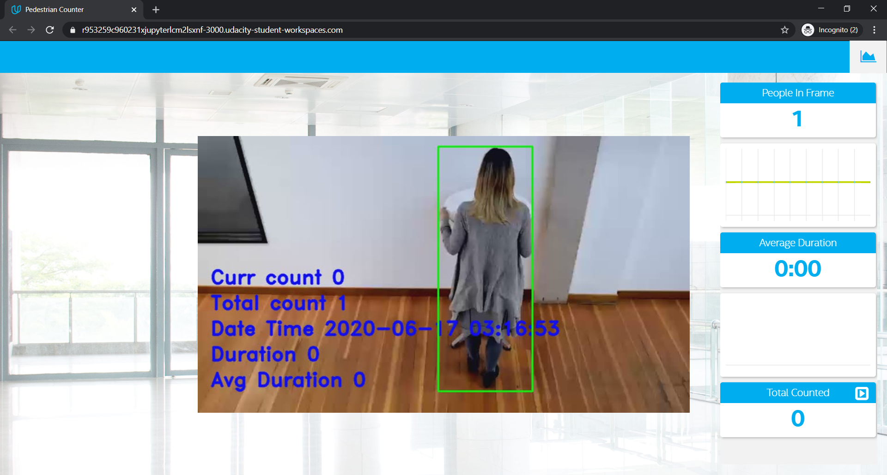
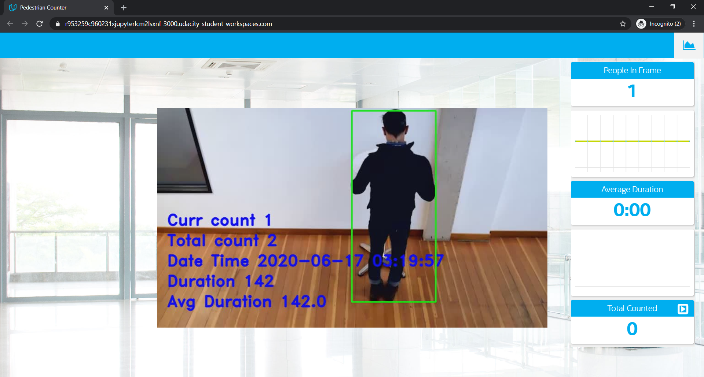
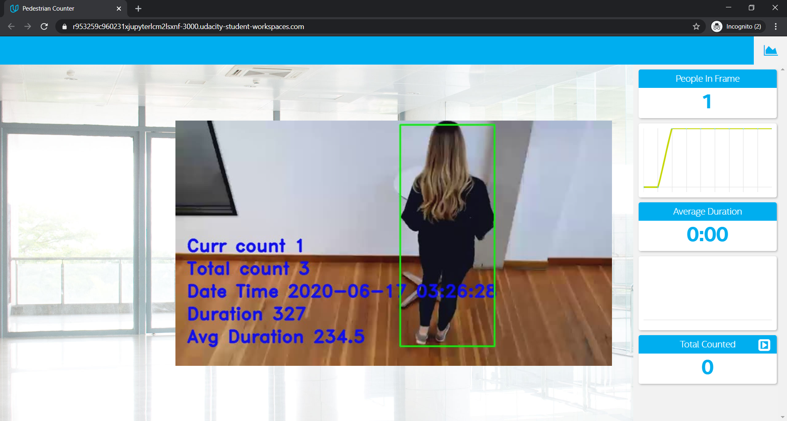
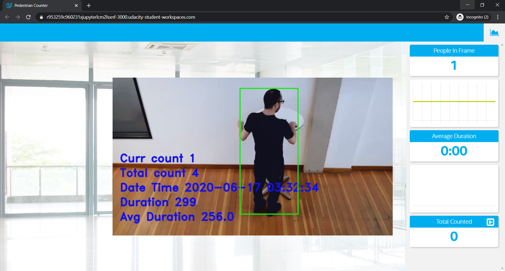
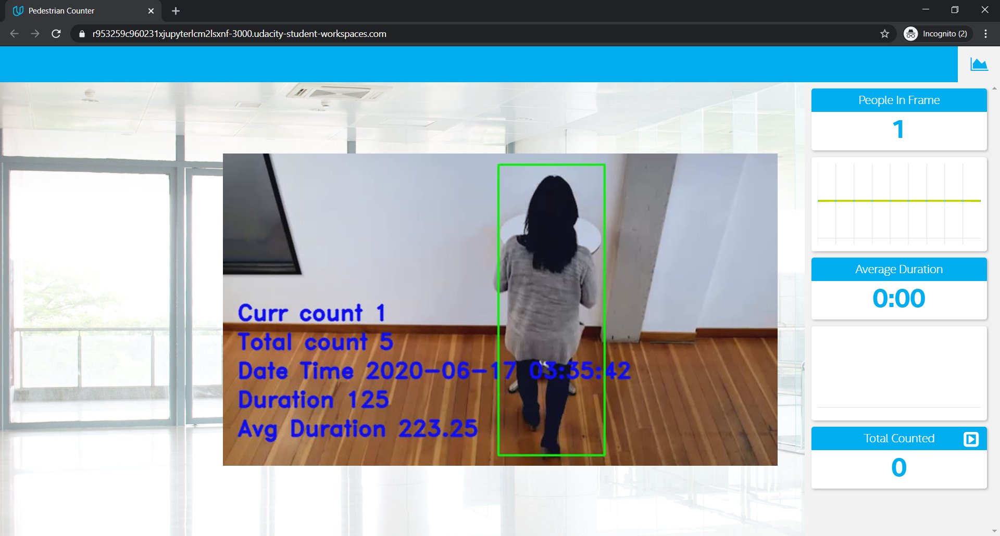
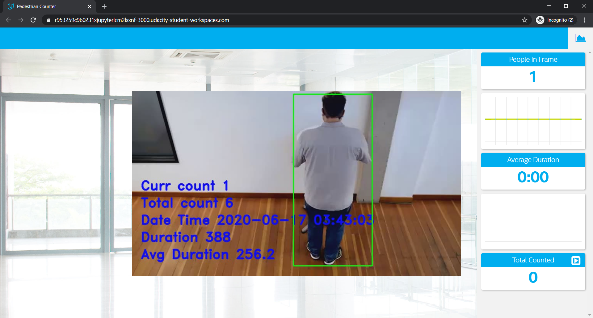
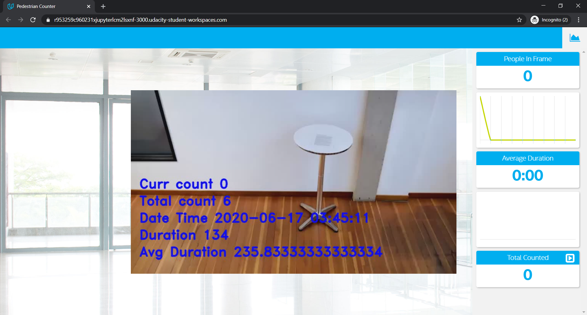

# Project Write-Up

# Deploy a People Counter App at the Edge

The people counter application demonstrates a smart video IoT solution using Intel® hardware and software tools. The app detects people in a designated area, providing the number of people in the frame, average duration of people in frame, and total count.   

The counter uses the Inference Engine included in the Intel® Distribution of OpenVINO™ Toolkit. The model used identifies people in a video frame. The app counts the number of people in the current frame, the duration that a person is in the frame and the total count of people. It then sends the data to a local web server using the Paho MQTT Python package.

## Explaining Custom Layers

<i> The process behind converting custom layers involves... </i>   

<i> Some of the potential reasons for handling custom layers are...</i>     

Intermediate Representations (IRs) are the OpenVINO™ Toolkit’s standard structure and naming for neural network architectures. A Conv2D layer in TensorFlow, Convolution layer in Caffe, or Conv layer in ONNX are all converted into a Convolution layer in an IR.   

The IR is able to be loaded directly into the Inference Engine, and is actually made of two output files from the Model Optimizer: an XML file and a binary file. The XML file holds the model architecture and other important metadata, while the binary file holds weights and biases in a binary format. Both these files are needed in order to run inference. Certain precisions are generated with the data_type argument, the default data_type argument being FP32.   

Model Optimizer searches for each layer of the input model in the list of known layers before building the model's internal representation, optimizing the model, and producing the Intermediate Representation.   

Custom layers are layers that are not included into a list of known layers. If the topology contains any layers that are not in the list of known layers, the Model Optimizer classifies them as custom. Handling custom layers depends on the framework being used.    

The list of known layers is different for each of supported frameworks. 

I have used "Faster R-CNN Inception V2 COCO" model in this project. The Faster R-CNN is a network that does object detection. In this project, we are detecting a person in a frame. The following link lists models available in Tensorflow. https://docs.openvinotoolkit.org/2019_R3.1/_docs_MO_DG_prepare_model_convert_model_Convert_Model_From_TensorFlow.html

I have used Udacity workspace for this project.    
I have used the following commands, written in the order, to convert the model to IR.
1. Download faster_rcnn_inception_v2_coco_2018_01_28.tar.gz    
wget http://download.tensorflow.org/models/object_detection/faster_rcnn_inception_v2_coco_2018_01_28.tar.gz
2. Unzip the tar file    
tar -xvf faster_rcnn_inception_v2_coco_2018_01_28.tar.gz
3. Check the folder.    
cd faster_rcnn_inception_v2_coco_2018_01_28
4. Convert model to IR    
python /opt/intel/openvino/deployment_tools/model_optimizer/mo.py --input_model frozen_inference_graph.pb --tensorflow_object_detection_api_pipeline_config pipeline.config --reverse_input_channels --tensorflow_use_custom_operations_config /opt/intel/openvino/deployment_tools/model_optimizer/extensions/front/tf/faster_rcnn_support.json

## Comparing Model Performance

I have used “Faster R-CNN Inception V2 COCO" model. I got errors when I ran the project before conversion. I was able to run the program after converting the model to IR.

<i> My method(s) to compare models before and after conversion to Intermediate Representations were...</i>    

<i> The difference between model accuracy pre- and post-conversion was...</i>   

I got errors when I ran the project before conversion by using .pb file. The app is expecting .xml and .bin files.   But I still have to check the difference between pre-conversion and post-conversion. I have written another code tf_main.py using tensorflow. The code in the file tf_main.py is almost similar to main.py, except, I am using tensorflow to detect objects. I have used the same model "Faster R-CNN Inception V2 COCO", since I am using this for post-conversion.    I have generated an output video file tf_out.mp4.   The command to run the pre-conversion file is:     
 python tf_main.py -i resources/Pedestrian_Detect_2_1_1.mp4 -m faster_rcnn_inception_v2_coco_2018_01_28/ -pt 0.4     

In terms of accuracy in detecting the objects - I did not find any significant difference in detecting objects pre and post conversion.         

<i>The size of the model pre- and post-conversion was...</i>    
The size of the model pre-conversion (.pb file) was -> 48447 kb      
The size of the model post-conversion (xml + bin files) was -> 48277 kb    

<i>The inference time of the model pre- and post-conversion was...</i>     
In terms of time, the pre-conversion model took a little longer to run. I am writing the output to a video file for pre-conversion.     
The run time for pre-conversion was about 40 minutes. The run time for post-converstion was about 25 minutes.     
If accuracy is to be taken into account, the time taken to run the application should not matter. This time will defer depending on the hardware used.     
The time taken to convert the model to IR was 145.38 seconds.     

## Assess Model Use Cases

<i> Some of the potential use cases of the people counter app are...</i>    
<i> Each of these use cases would be useful because...</i>    
1.	Retail store entry and exit points    
Retail store or any store can keep track of number people entered into the store and exited from the store. This way the store owner may be able to track if the store is faring well, if it is over-crowded or under crowded. The traffic will help the store owner to take informed business decisions.
2.	Bank teller counter    
The bank can track the number of people at the teller counter. How long the teller takes to complete cash transactions.
3.	Pharmacy counter    
As with the bank teller counter, the pharmacy can keep track on how much time a person spends with the pharmacist.
4.	Apartment complex leasing office entry and exit points. 
5.	Airports, train stations, bus stations – entry and exist points.    
In the current world scenario, where social distancing is a norm, authorities can keep track of number of people gathered.    
These are a few of the use cases, but list can go on. There are many places where the model is highly useful.

## Assess Effects on End User Needs

<i> Lighting, model accuracy, and camera focal length/image size have different effects on a deployed edge model. The potential effects of each of these are as follows...</i>    
Lighting helps in identifying an image better, in that, if the area being covered is bright, the person or object in the frame can be identified with better accuracy. If the area being covered is dark, the detecting the objects could be difficult.    
Camera focal length/image size helps in identifying the object better. If the image captured is of high resolution, the accuracy is improved.

## Model Research

[This heading is only required if a suitable model was not found after trying out at least three different models. However, you may also use this heading to detail how you converted a successful model.]

<i> In investigating potential people counter models, I tried each of the following three models:</i>

- Model 1: SSD MobileNet V2 COCO
  - [Model Source]  http://download.tensorflow.org/models/object_detection/ssd_mobilenet_v2_coco_2018_03_29.tar.gz    
  command used -> 
wget http://download.tensorflow.org/models/object_detection/ssd_mobilenet_v2_coco_2018_03_29.tar.gz

  - I converted the model to an Intermediate Representation with the following arguments...      
  <i> (unzip using tar -xvf <filename>)</i>    
tar -xvf ssd_mobilenet_v2_coco_2018_03_29.tar.gz     
<i> (convert the model)</i>    
cd ssd_mobilenet_v2_coco_2018_03_29    
python /opt/intel/openvino/deployment_tools/model_optimizer/mo.py --input_model frozen_inference_graph.pb --tensorflow_object_detection_api_pipeline_config pipeline.config --reverse_input_channels --tensorflow_use_custom_operations_config /opt/intel/openvino/deployment_tools/model_optimizer/extensions/front/tf/ssd_v2_support.json      
<i>(Commands for running the application – we need four terminals to run the application.) </i>     
<i> ---terminal 1--- </i>      
source /opt/intel/openvino/bin/setupvars.sh -pyver 3.5    
cd webservice/server/node-server    
node ./server.js     
<i> ---terminal 2--- </i>    
source /opt/intel/openvino/bin/setupvars.sh -pyver 3.5    
cd webservice/ui    
npm run dev    
<i> ---terminal 3---</i>    
source /opt/intel/openvino/bin/setupvars.sh -pyver 3.5    
sudo ffserver -f ./ffmpeg/server.conf    
<i> ---terminal 4---</i>    
source /opt/intel/openvino/bin/setupvars.sh -pyver 3.5    
python main.py -i resources/Pedestrian_Detect_2_1_1.mp4 -m home/workspace/ssd_mobilenet_v2_coco_2018_03_29/frozen_inference_graph.xml -l /opt/intel/openvino/deployment_tools/inference_engine/lib/intel64/libcpu_extension_sse4.so -d CPU -pt 0.6 | ffmpeg -v warning -f rawvideo -pixel_format bgr24 -video_size 768x432 -framerate 24 -i - http://0.0.0.0:3004/fac.ffm

  - <i> The model was insufficient for the app because...</i>     
  The model did not detect person number 2. I ran the application few times by modifying my code, but, the model never detected person number 2. The total count went upto 32. The lowest total count I got was 9 and this was again without detecting person number 2.    
  - <i> I tried to improve the model for the app by...</i>     
  I lowered the probability threshold to 0.4. I also tried changing the framerate from 24 to 10. But, still, person number 2 was not detected. The lowest total count I got was 9.
  
- Model 2: person-detection-retail-0013    
  - [Model Source]     
  wget https://download.01.org/opencv/2019/open_model_zoo/R1/models_bin/person-detection-retail-0013/FP32/person-detection-retail-0013.xml     
wget https://download.01.org/opencv/2019/open_model_zoo/R1/models_bin/person-detection-retail-0013/FP32/person-detection-retail-0013.bin     

  - <i> I converted the model to an Intermediate Representation with the following arguments...</i>    
  This is Intel’s pre-trained model, so it did not need conversion.    
  - <i> The model was insufficient for the app because...</i>     
  The model was perfect. From the start of the video, all six people were detected correctly.     
  While searching for a second model, I accidentally saw person-detect-retail-0013 model. Out of curiosity, I downloaded and tested this model. But, this is pre-trained model.     
  Per rubric, I have to opt for pre-trained model, after trying 3 different models for conversion. So I looked for another model.   
  - <i> I tried to improve the model for the app by...</i>     
  This model did not need improvement.

- Model 3: Faster RCNN Inception V2 COCO     
  - [Model Source] wget http://download.tensorflow.org/models/object_detection/faster_rcnn_inception_v2_coco_2018_01_28.tar.gz   
  <i> (unzip using tar -xvf <filename>)</i>     
tar -xvf faster_rcnn_inception_v2_coco_2018_01_28.tar.gz     
<i>(convert the model)</i>     
cd faster_rcnn_inception_v2_coco_2018_01_28     
python /opt/intel/openvino/deployment_tools/model_optimizer/mo.py --input_model frozen_inference_graph.pb --tensorflow_object_detection_api_pipeline_config pipeline.config --reverse_input_channels --tensorflow_use_custom_operations_config /opt/intel/openvino/deployment_tools/model_optimizer/extensions/front/tf/faster_rcnn_support.json   
<i> (Commands for running the application – we need four terminals to run the application.)</i>     
<i> ---terminal 1---</i>    
source /opt/intel/openvino/bin/setupvars.sh -pyver 3.5    
cd webservice/server/node-server    
node ./server.js    
<i> ---terminal 2---</i>    
source /opt/intel/openvino/bin/setupvars.sh -pyver 3.5    
cd webservice/ui    
npm run dev    
<i> ---terminal 3---</i>    
source /opt/intel/openvino/bin/setupvars.sh -pyver 3.5    
sudo ffserver -f ./ffmpeg/server.conf    
<i> ---terminal 4---</i>    
python main.py -i /home/workspace/resources/Pedestrian_Detect_2_1_1.mp4 -m /home/workspace/faster_rcnn_inception_v2_coco_2018_01_28/frozen_inference_graph.xml -l /opt/intel/openvino/deployment_tools/inference_engine/lib/intel64/libcpu_extension_sse4.so -d CPU -pt 0.4    

  - <i> I converted the model to an Intermediate Representation with the following arguments...</i>    
  I have written this in the above step    
  - <i> The model was insufficient for the app because...</i>    
  This model worked fine. The model was able to detect all 6 persons.      
  - <i> I tried to improve the model for the app by...</i>      
  I am counting the people with their entry co-ordinates. Initially, the model did not count person number 5. I modified the entry co-ordinates and tested the app extensively. I finalized the code, when I continuously got correct total count of 6 people. 

## Screen shots
    
    
    
    
    
    
    
